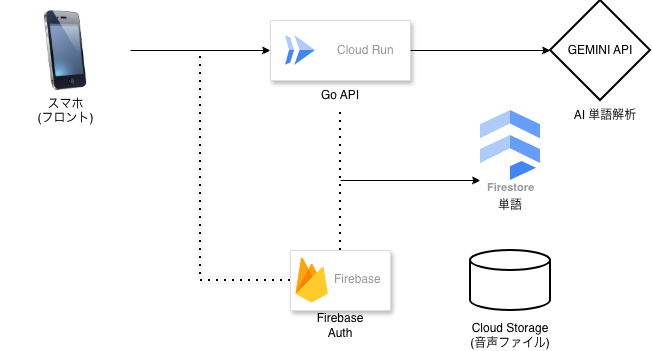

# vokanote - AI単語帳バックエンド

**vokanote** は、AIを活用して「単語登録」から「学習コンテンツ生成」「音声合成」までをすべて自動化する、単語帳アプリのバックエンドです。

## 🚀 プロジェクトの概要

単語を入力するだけで、AIがその単語に最適な学習コンテキストを生成します。
- **AI例文生成**: Gemini APIを活用し、単語のニュアンスに合わせた自然な韓国語例文と翻訳を自動生成。
- **ネイティブ音声合成**: Google Cloud Text-to-Speechにより、生成された例文を高品質な音声データに変換。
- **コスト管理**: 単語の削除やユーザー退会時に、関連する音声ファイル（Cloud Storage）も自動でクリーンアップし、不要なストレージコストを徹底排除。

---

## 🏗️ システム構成図

*FlutterFlow、Go、Google Cloud、Firebaseを組み合わせたアーキテクチャ*

---

## 🏗️ 使用技術

| 役割 | 選定技術 | 選定理由 |
| :--- | :--- | :--- |
| **Language** | **Go (Golang)** |
| **Infrastructure** | **Google Cloud Run** |
| **Database** | **Cloud Firestore** |
| **Storage** | **Cloud Storage** |
| **Authentication** | **Firebase Auth** |
| **AI Services** | **Gemini / TTS** |

---

## 🗄️ データベース構造 (Firestore Schema)

### **1. users コレクション**（ユーザー基盤）
| フィールド | 型 | 説明 |
| :--- | :--- | :--- |
| `display_name` | String | アプリ内での表示名 |
| `email` | String | ログイン用メールアドレス |
| `uid` | String | Firebase Auth の一意なID |
| `photo_url` | ImagePath | プロフィール画像のURL |
| `target_language` | String | 学習対象言語 (デフォルト: "Korean") |
| `created_at` | DateTime | アカウント作成日時 |
| `updated_at` | DateTime | プロフィール最終更新日時 |

### **2. vocabs コレクション**（学習コンテンツの核心）
| フィールド | 型 | 説明 |
| :--- | :--- | :--- |
| `word` | String | 韓国語単語（例：추억） |
| `meaning` | String | 日本語訳（例：思い出） |
| `example_kr` | String | AI生成の韓国語例文 |
| `example_jp` | String | 例文の日本語訳 |
| `audio_url` | String | 生成済み音声ファイルのストレージパス |
| `part_of_speech` | String | 品詞（動詞、名詞、形容詞など） |
| `is_learned` | Boolean | 習得済みフラグ |
| `user_ref` | Doc Ref (users) | 所有ユーザーへの参照 |
| `created_by / updated_by` | Doc Ref (users) | 作成・編集ユーザーの参照 |
| `created_at / updated_at` | DateTime | 登録・最終編集日時 |

### **3. tags コレクション**（拡張用：単語のグループ化）
| フィールド | 型 | 説明 |
| :--- | :--- | :--- |
| `tag` | String | タグ名（例：旅行、ビジネス、日常） |
| `user_ref` | Doc Ref (users) | 作成したユーザーへの参照 |
| `created_at` | DateTime | タグの作成日時 |
| `updated_at` | DateTime | タグの最終更新日時 |

### **4. app_config コレクション**（運営・法務管理）
| フィールド | 型 | 説明 |
| :--- | :--- | :--- |
| `terms_of_service` | String | 利用規約の全文テキスト |
| `privacy_policy` | String | プライバシーポリシーの全文テキスト |
| `current_version` | String | アプリの最新バージョン（強制アップデート用） |
| `updated_at` | DateTime | 規約等の最終更新日（画面表示用） |

---

## 🛠️ 工夫した点

### 1. ムダをなくして、サクサク動く仕組み (`GenerateHandler`)
AI APIの呼び出しはコストが発生するため、以下の戦略を実装しました。
- **AIのムダ使い防止機能**: 新規生成前にFirestore上の同一ユーザー内の重複単語を検索。既存データがある場合はAI/TTSプロセスをスキップして即座にレスポンスを返し、**APIコストを0円に抑えつつ、ユーザー体験を最大化**させています。

### 2. 徹底したデータ整合性 (`DeleteHandler`)
システムにおいて「DBのレコードは消えたが、ファイルの実体が残る」という不整合を防ぐ設計にこだわりました。
- **削除処理**: ドキュメント削除に連動して、Cloud Storage上の音声バイナリも確実に削除。
- **退会時一括クリーンアップ**: ユーザー退会時には全関連データを再帰的に消去するロジックを実装。

### 3. 運用の柔軟性 (`app_config` の導入)
- **動的設定管理**: 利用規約やアプリのバージョン情報をDB管理にすることで、アプリ本体を再審査に出すことなく、運用側で即座に情報を更新できる柔軟性を確保しました。

---

## 👨‍💻 Author
**Kamada Yoshiki**
